# Prompt-Generator-for-AI-Text-to-Image-Models
Try it here! [AI Prompt Generator](https://aipromptgenerator.art). A simple, modular, customizable app to help you generate prompts quickly and easily for [Stable Diffusion](https://stability.ai/), [Midjourney](https://www.midjourney.com/home/?callbackUrl=%2Fapp%2F), and [Dall-E 2](https://openai.com/product/dall-e-2).

# Prompt Generator

A versatile and easy-to-use tool designed to generate interesting random custom prompts for AI image generation software, very useful for testing models! Works for [Stable Diffusion](https://stability.ai/), [Midjourney](https://www.midjourney.com/home/?callbackUrl=%2Fapp%2F), and [Dall-E 2](https://openai.com/product/dall-e-2). It lets you work as meticuluously or as lax as you want to, giving great and varied results with just a few clicks.

## Quick Start

Visit [AI Prompt Generator](https://aipromptgenerator.art) or download the code and open `index.html` in your browser to start creating prompts! If you prefer not to start from scratch, click the **Randomize** button to populate the fields with words from a default database (which might be updated in the near future). 

## How It Works

The generator takes a set number of random words from each category, shuffles them, and produces the desired number of unique prompts. You can copy the generated prompt to your clipboard and paste it into any application of your choice..

## Detailed Features

### Category Containers Explained

*(You can also use the **Up** and **Down** arrows on your keyboard to increase or decrease the number of words to draw from the container.)*

The **Category Containers** form the core of the prompt generation process. Each container represents a specific `[CATEGORY]`, such as `[SUBJECTS], [POSES], [SETTINGS], ETC.` You can add custom words or phrases to each container, control their inclusion in prompt generation using checkboxes, and specify the **Number of Words** to draw from each `[CATEGORY]`. Additionally, the containers can be rearranged by dragging and dropping their headers.

Each category container includes:

- **Category Label**: The name of the category you are working on.
- **Container Header**: The header of the container that let's you drag and drop it to rearrange them as you wish.
- **Text Pool**: In which you add whatever words (or phrases separated by commas) you want for that category.
- **Include Checkbox**: Really important, it controls whether the category is considered when generating prompts.
- **Lock Checkbox**: Prevents editing of the category content and shields it from being modified by accidental typing, the **Clear All** button or the **Randomize** button.
- **Number of Words**: Specifies how many words (or phrases separated by commas) are picked from the category.
- **Duplicate Category Button**: Duplicates the category including whatever text is there as well as the state of the checkboxes.
- **Add to Template Button**: Adds the category to the custom template. (More on this below.)
- **Delete Category Button**: Removes the category from the list. (There is an undo button for this in the sidebar.)

### Sidebar Features

*(The **New Category** Button in action.)*

The sidebar offers a range of convenient features to streamline your workflow:

- **New Category Button**: Lets you create your own new custom category containers.
- **Clear All Button**: Deletes all text from the category containers.
- **Undo Clear All Button**: Restores text cleared by an accidental click of **Clear All** button due to mouse lag (Lesson learned.)
- **Save Custom Prompts Button**: Exports your current workspace (words and categories) to an external `.json` file.
- **Load Custom Prompts Button**: Imports an external `.json` file with whatever words and categories you previously created, enabling you to easily switch between various curated themes.
- **Add Custom Prompts Button**: Merges words and categories from a `.json` file with existing ones.
- **Save All Button**: Stores the current layout and text in your browser storage, preserving your setup across sessions.
- **Include All and Lock All Buttons**: Toggles inclusion and editing for all categories.

*(The **Randomize** Button in action.)*

- **Randomize Button**: Populates categories with a set number of random words.
- **Generate Button**: The star of the show, which makes everything happen. `Shift + Alt + G`
- **Undo Delete Category Button**: Restores deleted category containers.
- **Add All to Template Button**: Adds the `[CATEGORY]` name of all the containers with an active include checkbox to the template.
- **Restore Default Button**: Returns the application to its original state.
- **Advanced Layout Button**: Adds category containers pre-filled with common Stable Diffusion modifiers.

### Custom Prompt Template

The other star of the show. In short it works a bit like Mad Libs, where you specify whatever structure you wish your prompt to have and reference the `[CATEGORY]` you wish in square brackets (e.g. `[SUBJECTS], [CLOTHING],` etc.) so that the prompt generator fills that space with a random word or phrase from said container.

The placeholder shows a suggested sentence structure: 

- Seed: `[SUBJECTS], [CLOTHING], with [PROPS], in a beautiful [SETTINGS], [SCENE]`

Which after generation can look like this: 

- Result: `Adventurer, red shirt, with hiking stick, in a beautiful forest, spring.`

You can modify the weight of each word with brackets if you want and it will still work, like this: 

- Seed: `(([SUBJECTS])), [CLOTHING], with [PROPS], in a (beautiful [SETTINGS]), [SCENE]`
- Result: `((Adventurer)), red shirt, with hiking stick, in a (beautiful forest), spring.`

Or you can write it with numbers if you prefer:

- Seed: `[SUBJECTS]:0.95, [CLOTHING], with [PROPS], in a [SETTINGS]:0.4, [SCENE]`
- Result: `Adventurer:0.95, red shirt, with hiking stick, in a beautiful forest:0.4, spring.`

You can go as detailed as you want, like with a long Deforum prompt:

- Seed: `"0": "[SUBJECTS], [POSES] in a [SETTINGS], [VISUAL STYLES], [PENS], [ARTISTS]",
    "30": "[SUBJECTS2], "lora trigger word" [POSES2] in a [SETTINGS2], [VISUAL STYLES2], [PENS2], [ARTISTS2], [EMOTIONS], [DRAWING STYLES] <LORA:0.6>", "60": "[SUBJECTS3], [POSES2], in a [SETTINGS2], [VISUAL STYLES3], [ARTISTS3] --neg [CAMERAS], [ETCHINGS]", "90": "[SUBJECTS4], [PROPS], [ARTISTS]"`
- Result: `"0": "a strong greek god, wrestling in a Mountain Range, Stuckist, Pastel Art, by Caravaggio",
    "30": "caveman, taking_a_selfie standing in a futuristic city, Visual Novel, Ink, by Banksy, surprised, cel shading <SelfiesLORA:0.6>", "60": "tiger, jumping, in a frozen lake, fauvist, by Pixar Animation Studios --neg Fisheye Lens, Paper Model", "90": "urban ninja, laser sword, by Caravaggio"`
    
(Notice that "by Caravaggio" is repeated since in the Template Box the Category `[ARTISTS]` was repeated as well, you need to duplicate the container so you get `[ARTISTS2]`, `[ARTISTS3]`, etc. or create new containers in case you want different results.)

*(Use the **Add to Template Buttons** to save time from typing everything yourself.)*
    
I added the Add to Template button so that you can save yourself the time it takes to type the name of the category, and not worry about typos either. It also has a Keyboard Shortcut that sends whatever category is active to the Template Box. `Shift + Alt + T.`

*(Save time by using the **Duplicate** function. The **Randomize** button will keep working in the duplicated category.)*

You can also leave the Prompt Template box empty if you just want to generate random words and phrases separated by commas. In that case the prompt generating function outputs the words in the order of the category containers from top to bottom. Simply drag and drop the headers to rearrange the order.

*(Drag the Header of a Container and Drop on top of the Header of another Container.)*

## Sample Images

I have added a quick collage of images that I quickly generated by just clicking the randomize and generate button a few times just for this repo, so that you can see the versatility and variety. You can hover to see the prompt that was used for each image.

The models I used are all homemade blends from other maintstream models, but the originals are way better. My go-to models are: epic diffusion, counterfeitv30, rpgv4, vintedois, midjourneyv4, and redshift diffusion. You can get them from [Civitai](https://civitai.com/) or [Hugging Face](https://huggingface.co/models?pipeline_tag=text-to-image&p=1&sort=downloads).

<!-- Image Collage -->

  <h3>Image Collage</h3>
  

    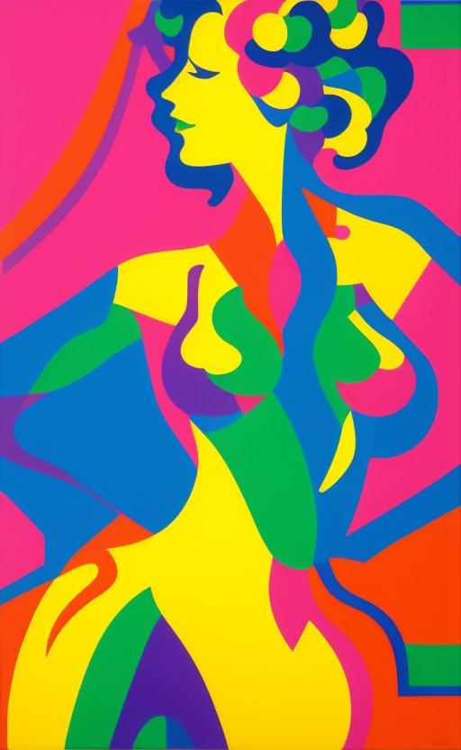
    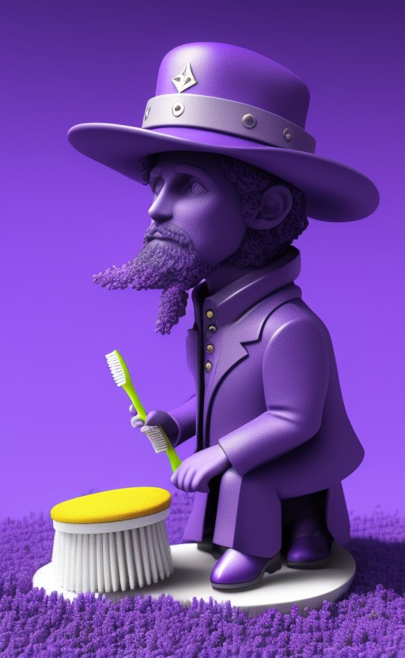
    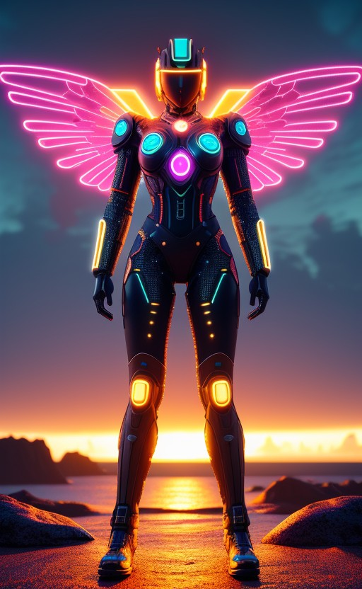
    
    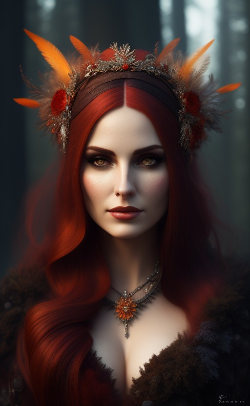
    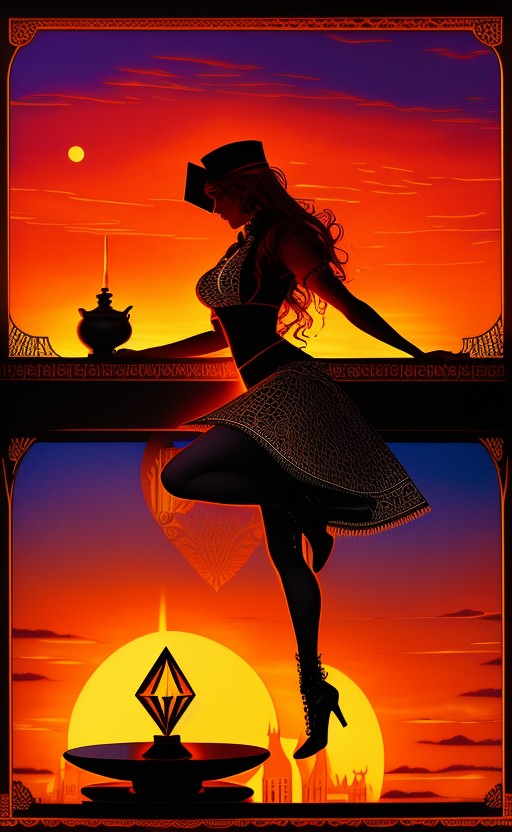
    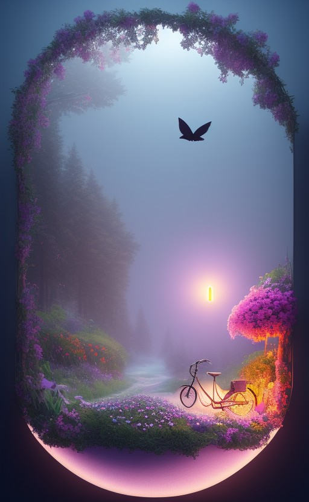
    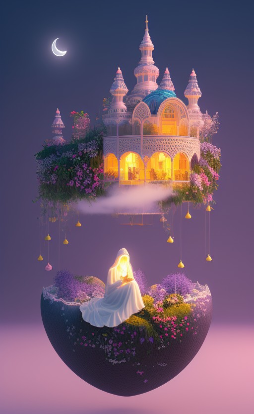
    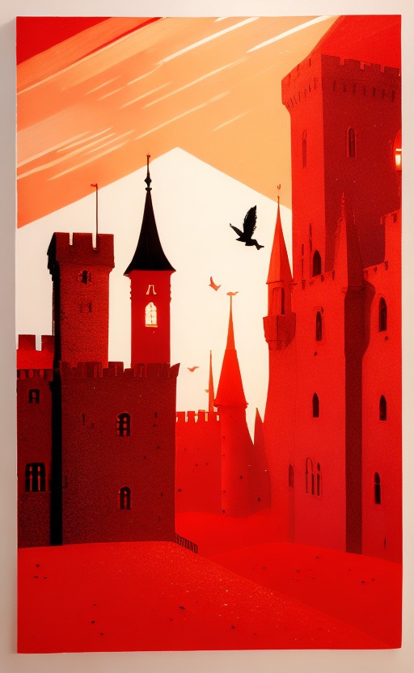
    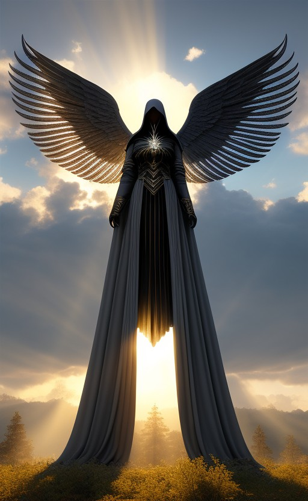
    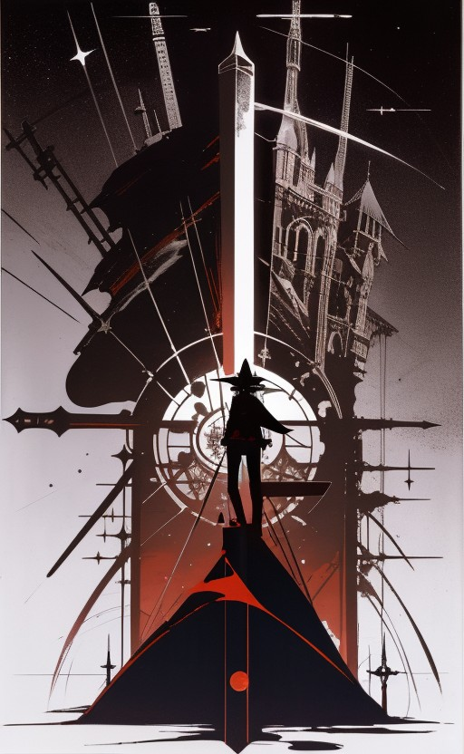
    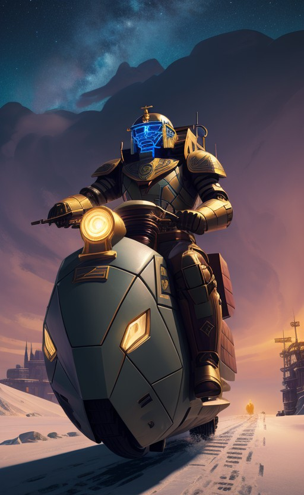
    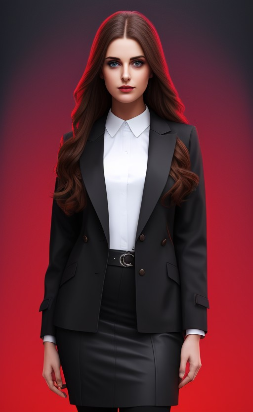
    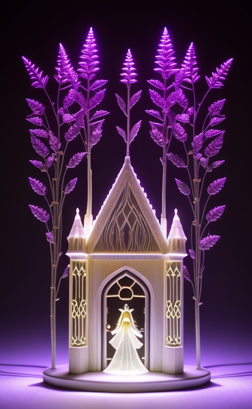
    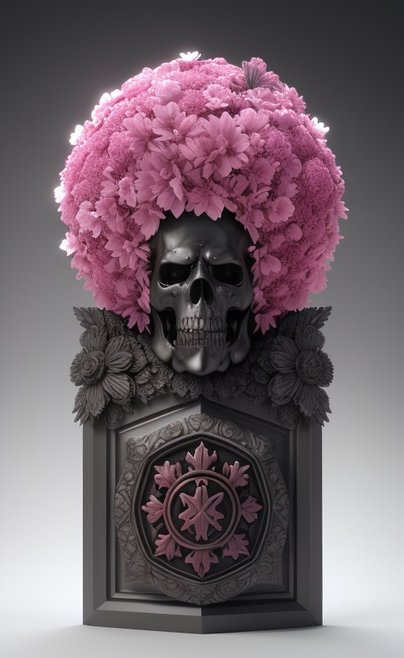
    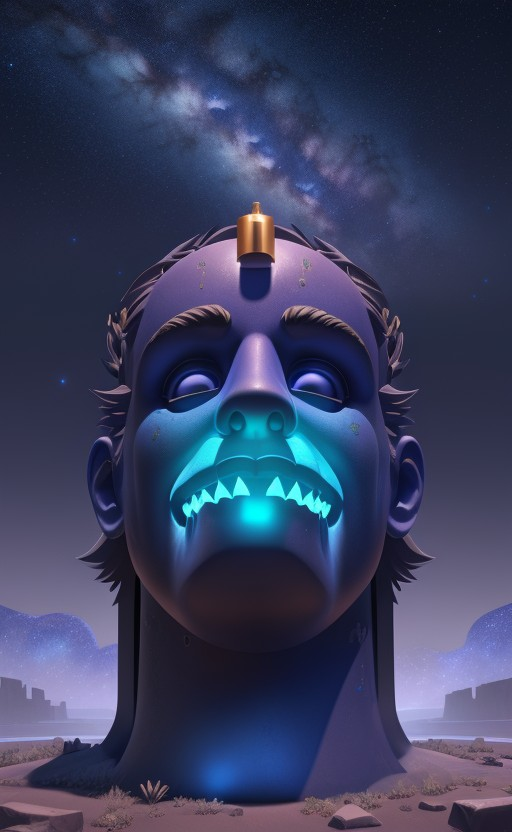
    <!-- Add more images here -->
  

  
     
    <em>*(In case you were curious about the result of that weird Deforum prompt I made up as an example.)*</em>

## Keyboard Shortcuts

Basically everything has a keyboard shortcut so that you can work as efficiently as possible. I'll list them below, but you can also just hover over whatever button or slider you want and see the title with their respective shortcut appear.

| Function                   | Shortcut                 |
|----------------------------|--------------------------|
| Add Category               | `Shift + Alt + N`          |
| Clear All                  | `Shift + Alt + C`          |
| Undo Clear All             | `Shift + Alt + Q`          |
| Save Custom Prompts        | `Shift + Alt + S`          |
| Load Custom Prompts        | `Shift + Alt + O`          |
| Add Custom Prompts         | `Shift + Alt + 2`          |
| Save All                   | `Shift + Alt + M`          |
| Include All                | `Shift + Alt + P`          |
| Lock All                   | `Shift + Alt + L`          |
| Randomize                  | `Shift + Alt + W`          |
| Generate                   | `Shift + Alt + G`          |
| Undo Delete Category       | `Shift + Alt + E`          |
| Add All to Template        | `Shift + Alt + A`          |
| Restore Default            | `Shift + Alt + D`          |
| Advanced Layout            | `Shift + Alt + 4`          |
| Spell Check Toggle         | `Shift + Alt + 7`          |
| Undo Delete All            | `Shift + Alt + 5`          |
| Clear History              | `Shift + Alt + H`          |
| Delete All Category Containers | `Shift + Alt + Y`       |
| Top Secret Dev Code to Clear Textboxes | `Shift + Alt + 0` |

And these shortcuts respond to whatever category container is currently active.

| Function                   | Shortcut                 |
|----------------------------|--------------------------|
| Include Active Container   | `Shift + Alt + U`          |
| Lock Active Container      | `Shift + Alt + K`          |
| Duplicate Active Container | `Shift + Alt + B`          |
| Add Active Category Label to Custom Template Box | `Shift + Alt + T`|
| Delete Active Category Container  | `Shift + Alt + X` |

*Note: These shortcuts are based on the default keybindings and may vary depending on your browser or operating system.*

## Undo

I've implemented as many undo features that I could think of so that you can work without fear and let your creativity loose. Right now you can undo the **"Clear All"**, **"Delete"** and **"Delete All"** functions, I have tested them in many ways but I'm sure there are some bugs here and there still, so please be mindful and take advantage of the **Save** Functions as well to avoid losing valuable work.

There is also a regular `"Ctrl + Z"` undo and `"Ctrl + Y"` redo feature for when you are typing or deleting text in the textboxes but again, please tell me if there are any issues with it and I'll see to fix them as soon as I can.

## Browser Compatibility

Tested primarily in Windows with the latest version of Chrome. Some light testing in Firefox as well, and also on Chrome and Safari in MacOs.

## Contributing

Pull requests are welcome. For major changes, please open an issue first to discuss what you would like to change.

## Credits

The slider used on this website is based on the Quiet Swan 35 slider developed by TimTrayler. You can find the original slider [here](https://uiverse.io/TimTrayler/quiet-swan-35).

## License

[GNU GPLv3](https://choosealicense.com/licenses/gpl-3.0/)
